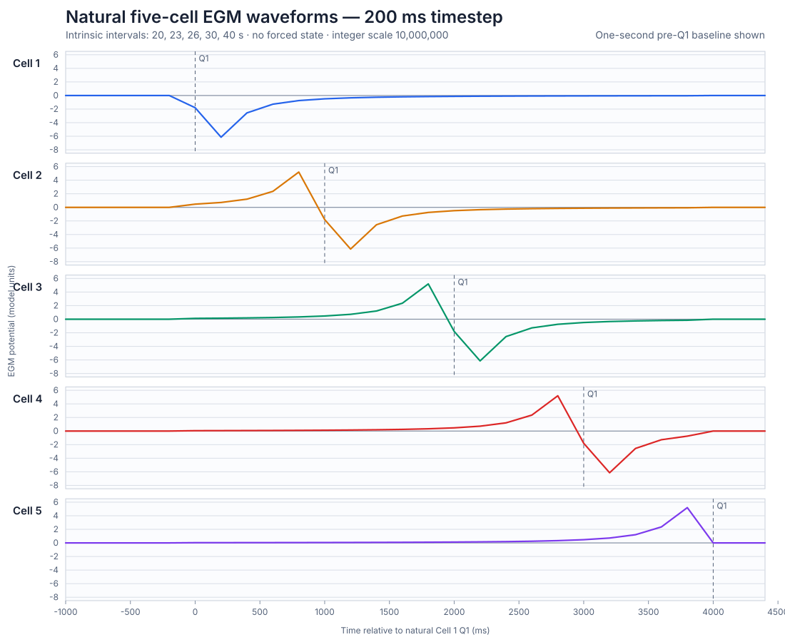
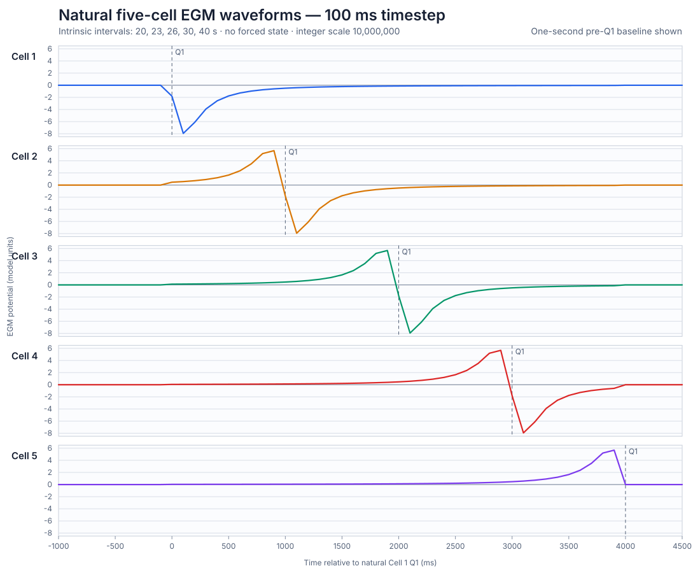
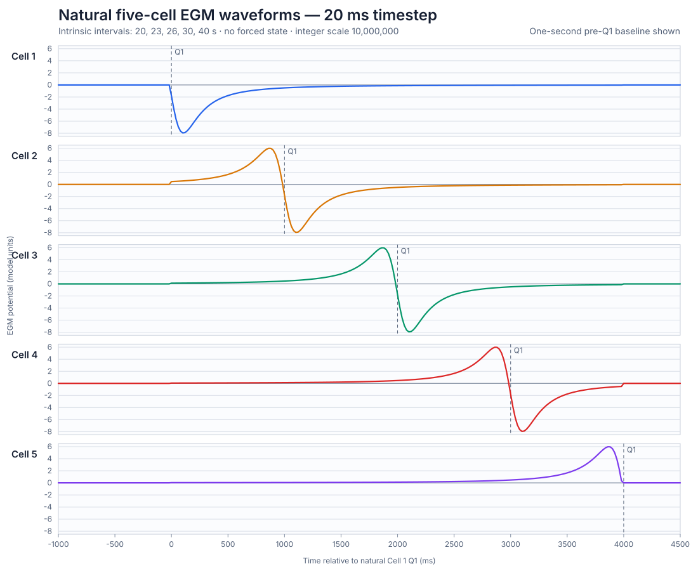
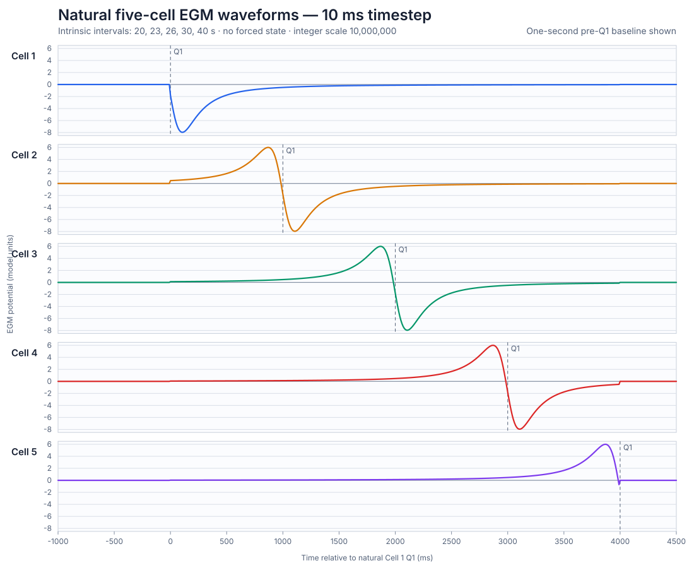

# All-Timestep Five-Cell EGM Waveform Record

Validation date: 2026-08-16

## Purpose

This record contains the EGM waveform observed at every cell position in the
five-cell FlexPRET network for every supported timestep. The plotted wave is
generated by the ICC state machine: no cell state is forced for this waveform
test.

## Simulation configuration

- Simulator: FlexPRET Verilator emulator (`fp-emu`)
- Timesteps: 200, 100, 50, 20, and 10 ms
- Cells: 5 at x = 0, 6000, 12000, 18000, and 24000 um
- Intrinsic intervals: 20, 23, 26, 30, and 40 s for Cells 1-5
- Paths: 4, each 6 mm with 1000 ms propagation delay
- Test scenario: 0, natural ICC state-machine execution
- Selected cycle: the second Cell 1 activation
- Direction: A-to-B (left to right) for every electrode
- EGM table: 801-entry relative-potential LUT
- Integer scale: 10,000,000 stored units per model-potential unit
- Raw simulation duration: 30,000 ms
- Plotted window: -1000 through +4500 ms relative to Cell 1 Q1
- Runtime arithmetic: integer only

All cells begin in the model's WAIT state. Consequently, the initial WAIT
release near 5 s causes all five cells to enter Q1 together; this startup
transient is retained in the raw traces but is not presented as propagation.
The next Cell 1 activation is generated intrinsically by its 20 s interval.
Cells 2-5 then enter Q1 from path relays at exactly 1000 ms spacing. The plotted
window includes one second before this natural Cell 1 Q1, making the pre-Q1
baseline visible.

Cell 5 is the terminal boundary. It has an incoming path but no outgoing path,
so it does not produce the same post-Q1 negative outgoing feature as Cells 1-4.

## Reproduction

```bash
cd /home/eugene/gastric-pacemaker/fp-ges/apps/icc-model
./tools/run_egm_waveform_tests.sh
```

The script cross-builds and runs 25 finite simulations: five timesteps by five
electrode positions. Every run asserts the electrode coordinate and automatic
termination. For each timestep it additionally asserts that the selected
Cell 1 Q1 is intrinsic and that Cells 2-5 activate from paths at 1000 ms
intervals. It writes raw traces, Q1 event records, SVG plots, and one combined
all-cell CSV under `generated/egm_relative/waveforms_natural_a_to_b/`.

## Natural Q1 events

| Timestep | Cell 1 intrinsic | Cell 2 path | Cell 3 path | Cell 4 path | Cell 5 path |
|---:|---:|---:|---:|---:|---:|
| 200 ms | 25200 | 26200 | 27200 | 28200 | 29200 |
| 100 ms | 25100 | 26100 | 27100 | 28100 | 29100 |
| 50 ms | 25050 | 26050 | 27050 | 28050 | 29050 |
| 20 ms | 25020 | 26020 | 27020 | 28020 | 29020 |
| 10 ms | 25010 | 26010 | 27010 | 28010 | 29010 |

Times are absolute simulation milliseconds. The small timestep-dependent
offset is the quantised WAIT-state release. The test runner also generates
temporary `egm_q1_events_*ms.csv` files containing relative time and cause;
these reproducible intermediate files remain under the ignored `generated/`
directory.

## Recorded waveform CSV files

The tracked files are stored in `validation/egm_relative/waveforms/`. Columns:

```text
sample,time_ms,time_from_pacemaker_q1_ms,cell_1_egm_scaled,cell_2_egm_scaled,cell_3_egm_scaled,cell_4_egm_scaled,cell_5_egm_scaled
```

| Timestep | Samples | CSV SHA-256 |
|---:|---:|---|
| 200 ms | 28 | `8ccee744f38fed340af76e366fbfa6da7a0674e142003bd97293b0f7294d2f1a` |
| 100 ms | 56 | `5420a2620fdf76461ffda2c8b8bf9270a060e9a52cb7e65e5d0a43cdae927ece` |
| 50 ms | 111 | `33861e98fac16f2af331e71ac14a8dc25b1ffd8c6f95c7b8b5b9bbc94b240e35` |
| 20 ms | 276 | `8b266a60ad838481a31e3b6e8b74973163b5c4eee43acd5306c9a5d09b4cff60` |
| 10 ms | 551 | `e8dbdb30253ae1e97fed03d035c5b29d87ca15b2ff6d7227c284d0ea3d1e58a4` |

The values are exact integer runtime results. Divide by 10,000,000 to recover
model-potential units.

## Numerical extrema

Each entry is `minimum @ relative time / maximum @ relative time`, using scaled
integer EGM values and milliseconds.

| Timestep | Cell 1 | Cell 2 | Cell 3 | Cell 4 | Cell 5 |
|---:|---|---|---|---|---|
| 200 ms | -61394733 @ 200 / 0 @ 4400 | -61394733 @ 1200 / 51949390 @ 800 | -61394733 @ 2200 / 51949390 @ 1800 | -61394733 @ 3200 / 51949390 @ 2800 | 0 @ 4400 / 51949390 @ 3800 |
| 100 ms | -79444198 @ 100 / 0 @ 4500 | -79444198 @ 1100 / 56745855 @ 900 | -79444198 @ 2100 / 56745855 @ 1900 | -79444198 @ 3100 / 56745855 @ 2900 | 0 @ 4500 / 56745855 @ 3900 |
| 50 ms | -79444198 @ 100 / 0 @ 4500 | -79444198 @ 1100 / 59135004 @ 850 | -79444198 @ 2100 / 59135004 @ 1850 | -79444198 @ 3100 / 59135004 @ 2850 | 0 @ 4500 / 59135004 @ 3850 |
| 20 ms | -79444198 @ 100 / 0 @ 4500 | -79444198 @ 1100 / 59798246 @ 860 | -79444198 @ 2100 / 59798246 @ 1860 | -79444198 @ 3100 / 59798246 @ 2860 | 0 @ 4500 / 59798246 @ 3860 |
| 10 ms | -79530905 @ 110 / 0 @ 4000 | -79530905 @ 1110 / 60005398 @ 870 | -79530905 @ 2110 / 60005398 @ 1870 | -79530905 @ 3110 / 60005398 @ 2870 | -7161294 @ 3990 / 60005398 @ 3870 |

## Waveform figures

The dashed line in each panel marks that electrode cell's Q1 activation. The
x-axis is relative to natural Cell 1 Q1; negative time is the pre-Q1 baseline.

### 200 ms



### 100 ms



### 50 ms


### 20 ms



### 10 ms



## Interpretation

Cells 2-4 show a positive approach followed by a negative outgoing feature,
shifted by exactly 1000 ms from one cell to the next. Cell 1 is the intrinsic
source and shows the outgoing negative feature. Cell 5 shows the incoming
feature at the network boundary and returns to zero because there is no fifth
outgoing path.

## Limitations

- These are cycle-accurate Verilator simulation results, not DE1-SoC board measurements.
- Potentials are uncalibrated model units.
- The network is one-dimensional and has a terminal boundary at Cell 5.
- Tissue volume conduction, electrode impedance, filtering, and noise are not represented.
